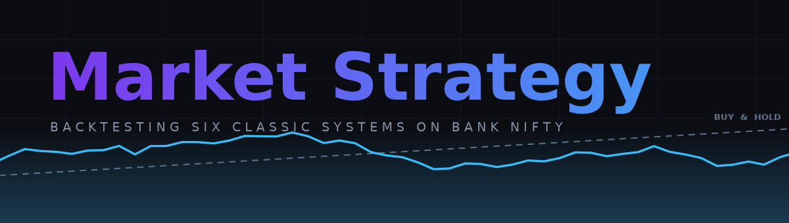
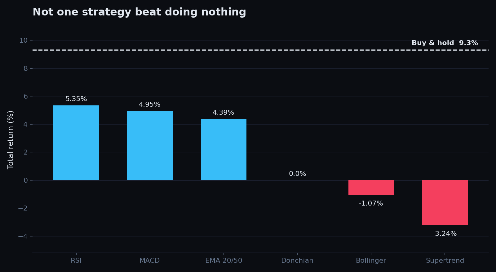
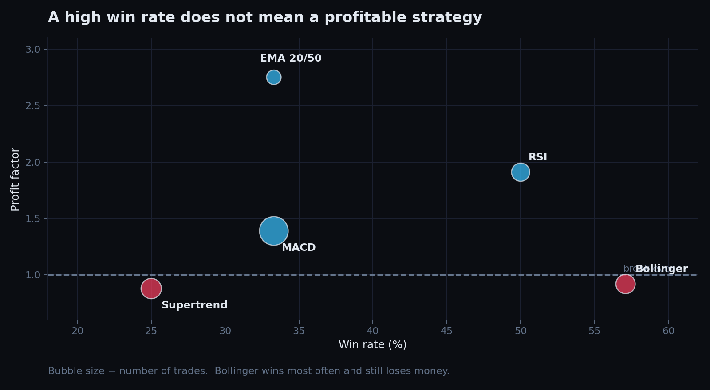
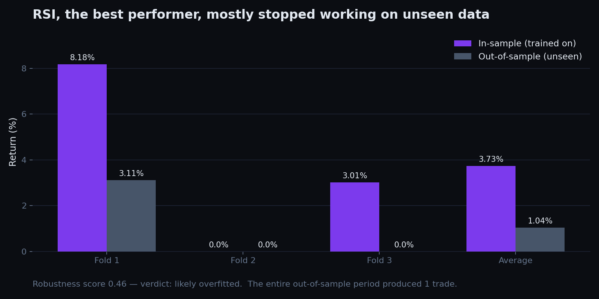

<p align="center">
  
</p>

<p align="center">
  
  
  
  
  
</p>

---

## What this is

Six classic trading strategies, backtested on the same instrument over the same
period, judged on the metrics that actually decide whether an edge exists.

The interesting part is not which one won. It is that **none of them beat doing
nothing**, and the one that came closest fell apart the moment it saw data it
had not been fitted to.

**Instrument:** Bank Nifty (`^NSEBANK`) · **Period:** Jul 2024 – Jul 2026 ·
**495 daily candles** · costs charged on every trade

---

## Finding 1 — every strategy lost to buy-and-hold



| Rank | Strategy | Return | Trades | Win rate | Profit factor | Max drawdown |
|:---:|---|---:|---:|---:|---:|---:|
| 1 | RSI Oversold/Overbought | **+5.35%** | 6 | 50.0% | 1.91 | −3.60% |
| 2 | MACD Crossover | +4.95% | 18 | 33.3% | 1.39 | −5.55% |
| 3 | EMA 20/50 Cross | +4.39% | 3 | 33.3% | 2.75 | −2.32% |
| 4 | Donchian Breakout | 0.00% | 0 | — | — | — |
| 5 | Bollinger Mean Reversion | −1.07% | 7 | 57.1% | 0.92 | −7.53% |
| 6 | Supertrend | −3.24% | 8 | 25.0% | 0.88 | −8.89% |
| — | **Buy and hold** | **+9.30%** | 1 | — | — | — |

Buying the index and never touching it returned 9.30%. The best strategy managed
5.35% while taking six positions and paying costs on each one.

Donchian is worth noting rather than hiding: its breakout condition never
triggered across two years. A strategy that never fires is a real result about
parameter sensitivity, not a bug to quietly drop from the table.

---

## Finding 2 — a high win rate does not mean a profitable strategy



This is the clearest thing in the whole study.

**Bollinger has the highest win rate of anything tested — 57.1% — and it lost
money.** Its profit factor is 0.92, meaning it gave back more than it took.
Meanwhile **EMA cross won only 33.3% of the time and had the best profit factor
at 2.75**, because its winners were far larger than its losers.

Win rate says how often you are right. It says nothing about how much you make
when you are right, or lose when you are wrong. The metric that combines both is
expectancy:

```
expectancy = (win% x average win) - (loss% x average loss) - costs
```

A system that wins 35% of the time with 3:1 payoffs beats one that wins 70% of
the time with 1:2 payoffs. Optimising for win rate optimises for the wrong thing.

---

## Finding 3 — the winner was mostly overfitted



A single backtest number is close to meaningless on its own, so RSI — the top
performer — was put through **walk-forward validation**: split the history into
folds, fit on the earlier part of each fold, and measure on the later part it
had never seen.

| Fold | Trained on | In-sample | Out-of-sample |
|:---:|---|---:|---:|
| 1 | Jul 2024 – Jan 2025 | 8.18% | 3.11% |
| 2 | Mar 2025 – Sep 2025 | 0.00% | 0.00% |
| 3 | Nov 2025 – May 2026 | 3.01% | 0.00% |
| | **Average** | **3.73%** | **1.04%** |

**Robustness score: 0.46 — verdict: likely overfitted.** Out-of-sample
performance came in at roughly a quarter of in-sample, and the entire unseen
period produced exactly **one trade**.

That last number matters more than the percentages. Six trades in two years is
already too few to distinguish skill from luck; one trade is not a sample at all.
Any conclusion drawn from it would be storytelling.

---

## Why the metrics here are the ones they are

This project started somewhere else — an intraday opening-range-breakout system
on Bank Nifty futures but landed here, backtested over six months:

| | |
|---|---:|
| Trades | 120 |
| Win rate | 56.7% |
| Gross profit | ₹4,81,296 |
| **Commission paid** | **₹72,000** |
| **Net profit** | **₹31,632** |
| Max drawdown | ₹96,894 |

It looked like it worked. A 56.7% win rate reads well, and the net profit was positive.

Two things that were wrong. **Commission came to more than twice the net profit** —
the strategy was, in effect, being run for the broker. And **max drawdown was
three times the final profit**, so trading it would have meant sitting through
losses far larger than anything it ever made.

The deeper problem was that wins and losses were nearly the same size, so a 56.7%
win rate barely compounded. Trade frequency turned a thin edge into a rounding
error.

That is why this study measures profit factor, expectancy, drawdown and trade
count instead of leading with win rate, and why every trade here is charged
0.1% commission plus 0.05% slippage. Costs are not a footnote to a strategy.
They are frequently the entire result.

---

## Running it

```bash
git clone https://github.com/AyushChangedia/market-strategy.git
cd market-strategy
pip install -r requirements.txt

python backtest.py                              # Bank Nifty, 2 years
python backtest.py --symbol ^NSEI --period 5y   # Nifty 50, 5 years
python backtest.py --list-strategies            # what is registered
python backtest.py --strategy rsi --strategy macd
```

Any Yahoo Finance ticker works: `^NSEBANK`, `^NSEI`, `RELIANCE.NS`, `TCS.NS`.

**Validation and fills**

```bash
python backtest.py --walk-forward rsi           # fold-by-fold, the Finding 3 run
python backtest.py --walk-forward rsi --splits 4 --train-ratio 0.6
python backtest.py --fill next-bar              # how much edge survives a real fill
```

`--fill` decides which bar an order executes on. The default, `close`, books
the trade at the same close that produced the signal — convenient, and slightly
generous. `next-bar` books it at the following close, the earliest price you
could actually have acted on. Every published figure here uses the default.

**Figures and tests**

```bash
python make_charts.py                           # regenerate the three charts
python make_banner.py                           # regenerate the README banner
pip install -r requirements-dev.txt && pytest -q # 67 offline tests
```

The charts read `results/*.json`, so they never re-fetch data. The test suite
needs no network and no `yfinance`.

---

## What's in here

```
market-strategy/
├── backtest.py                      six strategies, cost-aware evaluation,
│                                    walk-forward validation
├── make_charts.py                   the three result charts
├── make_banner.py                   the README hero
├── tests/test_backtest.py           67 offline regression tests
├── results/
│   ├── comparison.json              full metrics for all six
│   └── walk_forward_rsi.json        fold-by-fold validation output
└── assets/                          banner and charts
```

Each strategy is a function returning a position series (`1` long, `0` flat).
Adding a seventh means writing one function and registering it in `STRATEGIES` —
the evaluation, cost model, walk-forward validation and reporting all apply
automatically, and the test suite picks it up too.

**On the benchmark.** Buy-and-hold is reported twice: gross, and net of the one
round trip it also has to pay. The tables above quote the gross 9.30%; the net
figure is 9.15%, which does not change the conclusion but makes the comparison
like-for-like, since every strategy is charged on every trade.

---

## What I would test next

- **Longer holding periods.** Everything here is short-horizon. Costs scale with
  trade count, so multi-week positions face a fraction of the drag.
- **Payoff ratio over hit rate.** EMA cross had the best profit factor while
  winning a third of the time. That asymmetry is worth pursuing on its own.
- **Position sizing.** Every trade here risks the same amount. Volatility-based
  sizing changes results more than most entry rules do.
- **More data.** Two years and single-digit trade counts cannot separate edge
  from noise. This needs a decade, or a basket of instruments.

---

## Disclaimer

Educational project. Not investment advice, and not a recommendation to trade
anything. Past performance does not predict future results — this study is a
demonstration of that point rather than an exception to it.
